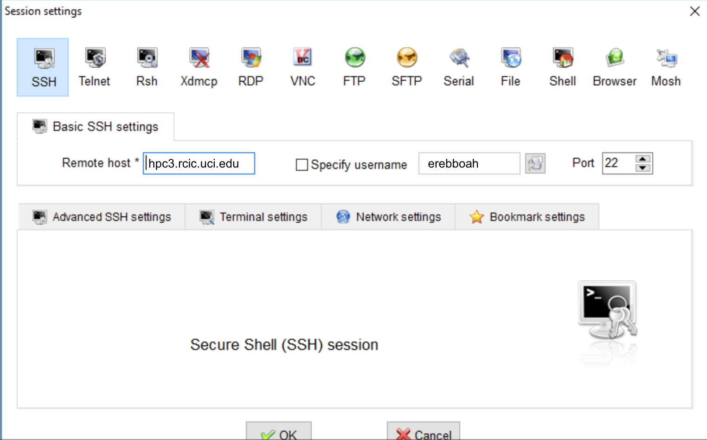
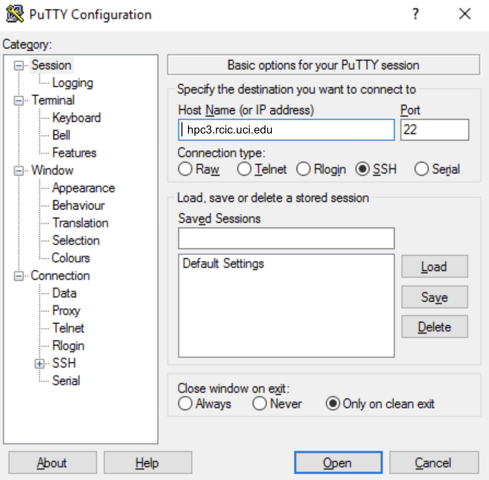
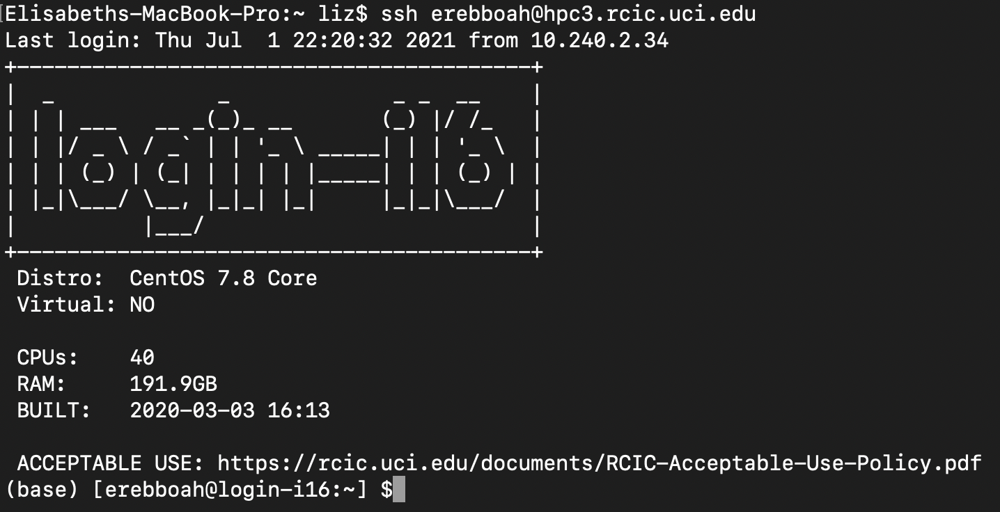
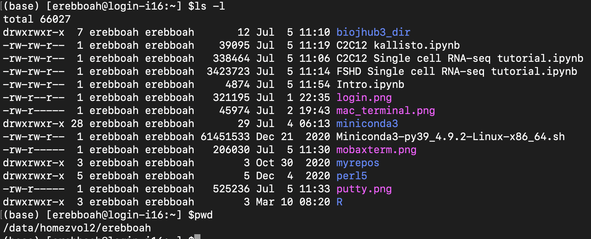
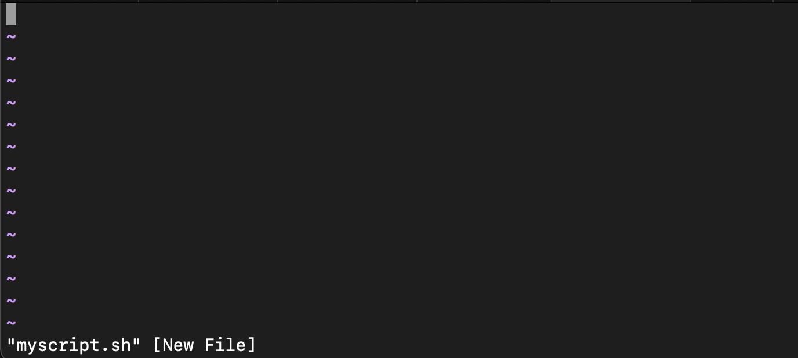
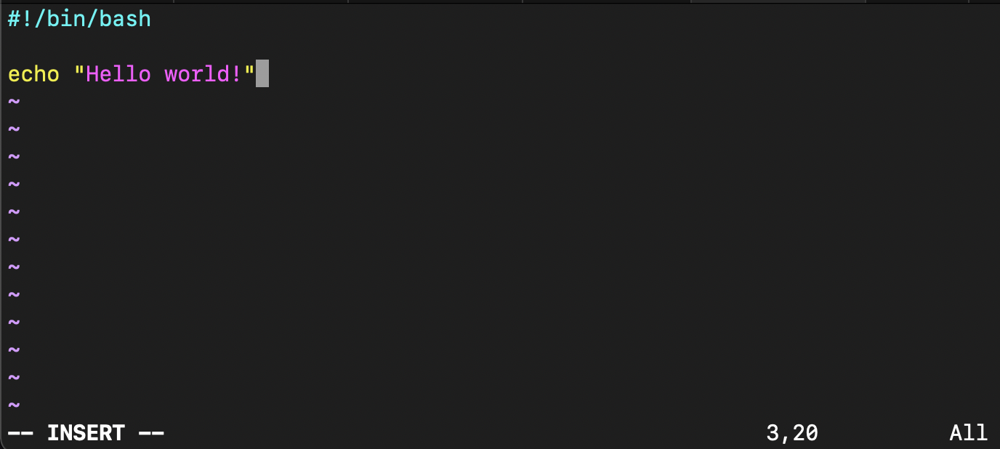
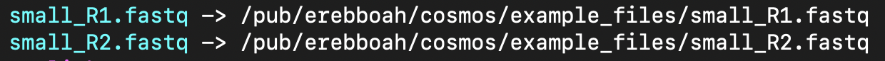

# Intro
Welcome to grad school! You are our new Class of Summer 2021 in **Cluster 6: Genes, Genomes, and Skeletal Muscle Dystrophies**, and and we have a lot to show you in the next 4 weeks!

For our first hands-on activity, we want to get everyone logged on to UCI's HPC (high performance computing) cluster. This will be slightly different between Mac, Windows, and Linux.

The [HPC cluster](https://en.wikipedia.org/wiki/HPCC) is a collection of interconnected computers or "nodes" that work together to perform computationally intensive tasks. There are multiple types of nodes, like "login" nodes, which are typically used to perform inexpensive tasks that we will use often such as creating and deleting folders, moving files around, copying files, etc., and "compute" nodes, which we will use to run jobs. We use a Secure Shell [(SSH)](https://en.wikipedia.org/wiki/Secure_Shell_Protocol) to connect to HPC from our local computer in a command line (also called "terminal") interface. 

Mac and Linux OS have a built-in terminal with ssh capabilities but Windows users will have to install an ssh application.

# Log on to HPC

### Windows SSH

For Windows 10, install [MobaXterm](https://mobaxterm.mobatek.net/). [Here](https://mobaxterm.mobatek.net/demo.html) is a demo on how to SSH. You only need the first 30 seconds or so, don't worry about X11 forwarding or other graphics displays since we will be using Jupyter notebooks to make plots.
<div>

</div>

For Windows 8, 7, Vista, and XP, install [PuTTY](https://www.putty.org/).
<div>

</div>

## Mac and Linux

Everyone who is not using Windows is most likely using Mac. For Mac users, type "terminal" into the search function. This is what mine looks like: 

<div>

</div>

## SSH into HPC
HPC's address is `hpc3.rcic.uci.edu`. 

Log into HPC using your UCI usename and password. For example my username is `erebboah`, so just replace that with your username and type `ssh username@hpc3.rcic.uci.edu`. For Windows users, use `hpc3.rcic.uci.edu` for the "Remote host" or "Host Name". Keep the default port as 22.

You will be prompted for your password, then you should see a login node home screen like this one:

<div>

</div>

# Practice basic Unix commands

A terminal is a lot different than the graphical user interfaces [(GUIs)](https://en.wikipedia.org/wiki/Graphical_user_interface) that we all know and love. Some of my favorite commands to help get situated are `ls -l` and `pwd`.

<div>

</div>

`ls` lists the contents of a directory and has several useful options like `-l` for long format to see more information like the file type, permissions, owner, size, and date created. Permissions include read (r), write (w), and execute (x) for the owner, group of related users, and everyone else. For example, `rwxrwxrwx` means everyone can read, write, and execute the file, while `rw-rw-r--` means the owner and users in the group can read and write it while users outside the group can read but cannot write it. More info on permissions [here](https://linuxcommand.org/lc3_lts0090.php).

Other useful `ls` options I use frequently: `-h` for human readable file sizes, `-t` to sort by time, earliest to latest; e.g. `ls -lth`.

`pwd` stands for print working directory and is very useful to figure out where you are and to copy paste the path into bash scripts. Avoid typing a directory path, just copy it from the `pwd` output so you don't get annoying "File not found" errors due to a typo. 

You may not have any files yet so let's make one! `touch myfile.txt` creates an empty text file. `mkdir new_folder` creates a new directory.

### What do these commands do?
- `cp myfile.txt new_folder/`
- `cd new_folder/`
- `mv myfile.txt myfile2.txt`
- `cp ../myfile.txt .`
- `rm myfile2.txt`
- `cd ../`
- `rm new_folder/`

That last one will give you an error - `rm: cannot remove ‘new_folder/’: Is a directory`. Some commands like `rm` and `cp` need you to specify that you want to remove or copy a folder, so you need to add the `-r` option: `rm -r new_folder`. **Be very careful with the `rm` command!** You won't be asked if you're sure you want to delete and there is no recycling bin/trash can!

### Tips:
-`..` represents one directory above the directory you're currently in  
-`.` represents the directory you're currently in  
-**Tab to complete!** Get used to pressing the tab button all the time! It works for files, directories, commands, options within commands, etc.  
-**Display the manual page for any command using `man`!** For example, `man rm`.

# Practice using the Unix text editor

Type `vi myscript.sh` to enter the basic Unix text editor. (Notice that it will make a new file, there's no need to run  `touch myscript.sh` first.) This screen comes up:

<div>

</div>

Type `i` to start inserting text. Copy paste this `#!/bin/bash` line called a [shebang](https://en.wikipedia.org/wiki/Shebang_(Unix)) to make an executable program, then type `echo "Hello world!"`. 

<div>

</div>

Get out of insert mode by hitting the escape key, then close the editor and write to the file by typing `:wq`. To quit without writing, `:q!`, or `:q` if nothing was changed. (You'll get an error `No write since last change (add ! to override)` if you use `:q` after changing the file.)

You just made a [shell script](https://en.wikipedia.org/wiki/Shell_script)! Run the script by `bash myscript.sh`. You can also make the script executable without having to use the `bash` command by changing its permissions: `chmod +x myscript.sh`. This allows you to simply type `./myscript.sh` to run it. The permissions changed from `rw-rw-r--` to `rwxrwxr-x`, meaning everyone can now execute your script.

# Bioinformatics data formats

## Fastq
Raw sequencing data is stored in [fastqs](https://support.illumina.com/bulletins/2016/04/fastq-files-explained.html) where each read is represented by 4 lines: a sequence identifier with run information, the sequence itself, a separator (usually a + sign), and the base call [quality scores](https://support.illumina.com/help/BaseSpace_OLH_009008/Content/Source/Informatics/BS/QualityScoreEncoding_swBS.htm) as ASCII characters.

We have some data from an Illumina paired-end bulk RNA-seq timecourse of a differentiating skeletal muscle cell line (C2C12). I took just the first 1000 reads (4000 lines) from the undifferentiated control cells to make small read 1: `/pub/erebboah/cosmos/example_files/small_R1.fastq` and read 2: `/pub/erebboah/cosmos/example_files/small_R2.fastq` fastqs. The full timecourse of compressed fastqs are in `/pub/erebboah/cosmos/C2C12_bulkRNA_timecourse/fastq`. These file paths are annoying to type out, so let's make symlinks to the data that's stored in my public directory using `ln -s`:

```
ln -s /pub/erebboah/cosmos/example_files/small_R1.fastq
ln -s /pub/erebboah/cosmos/example_files/small_R2.fastq
```

Now once you `ls -l` in your own directory you'll see these links which are pointing to the actual location of the files. You can `rm small_R1.fastq` to remove the link; the original file is unaffected.

<div>

</div>

The `head` command is useful to look at the first 10 lines of (uncompressed) files. Let's look at some raw data by `head small_R1.fastq`:

```
@NS500169:786:H7N2GBGXG:1:11101:6344:1027 1:N:0:CGTACT
GAGCTNGAGGAACTGAGGAACGAACATTCTGCTCGCTTCAAG
+
AAAAA#EEEEEEEEEEEEEEEEEEEEEEEEEEEEEEEEEEEE
@NS500169:786:H7N2GBGXG:1:11101:11801:1029 1:N:0:CGTACT
GAAAGNGGGCCGCCCTCTCGCCCGTCACGTTGAACGCACGTT
+
AAAAA#EEEEEEEEEEEEEEEEEEEEEEEEEEEEEEEEEEEE
@NS500169:786:H7N2GBGXG:1:11101:12004:1033 1:N:0:CGTACT
AACATNGGTCAGTCGGTCCTGAGAGATGGGCGAGTGCCGTTC
```

These files aren't too big, so we can also display the entire fastq by `cat small_R1.fastq`. If you're wondering how to look at a compressed fastq, `zcat` is the alternative: `zcat /pub/erebboah/cosmos/C2C12_bulkRNA_timecourse/fastq/Ctrl_0hr_A/Ctrl_0hr_A_R1.fastq.gz | head`.

### What do these commands do?
- `tail small_R1.fastq`
- `cat small_R1.fastq | head`
- `head -n 20 small_R1.fastq`
- `wc -l small_R1.fastq` (remember that I took the first 4000 lines of the original file)

### Tips:
- `|` is the pipe symbol which connects the output of one process to the input of another process  
- If you try the `zcat Ctrl_0hr_A_R1.fastq.gz` command and forgot to `head`, the whole file will spat into terminal- Ctrl + C to abort!

## SAM/BAM
Aligned sequences are stored in a Sequence Alignment Map or [SAM](https://www.metagenomics.wiki/tools/samtools/bam-sam-file-format) file which is much more complicated than a fastq but also stores a lot more information. 

A BAM file is simply the binary (compressed) version of a SAM file. These files can be very very big so most operations are done on the binary files. This means you can't use `head` to look at them, and `zcat` is only used for gzipped files.

Our solution: [samtools](http://www.htslib.org/doc/samtools.html)! Samtools is a very useful set of utilities for messing with sam (and bam) files. 

```
module load samtools # samtools is already installed on HPC, you just need to load it
samtools --help # what commands are available
samtools view --help # how to use a specific command, what the options are
samtools view /pub/erebboah/cosmos/example_files/Ctrl_0hr_A_Aligned.sortedByCoord.out.bam | head
```

# Submit a job to HPC
While the shell script `myscript.sh` we made is executable, it doesn't have enough details to be a proper job that we submit to the HPC scheduler. There are two main types of job schedulers, [SLURM and SGE](https://srcc.stanford.edu/sge-slurm-conversion); we are using [SLURM](https://rcic.uci.edu/hpc3/slurm.html) (so named to reference the soda in Futurama).

<div>

</div>

Let's start with a job to check the quality of our paired-end fastqs. Before we write the script, let's figure it out on the command line with our small sample fastqs. 

We'll be using [fastqc](https://www.bioinformatics.babraham.ac.uk/projects/fastqc/), which is already installed on HPC and can be loaded by `module load fastqc`. Now if you type `fastqc --help` or `fastqc -h`, you should see the manual for the package. To run it on the example fastqs (and using those symlinks from before, if you made them):
```
fastqc small_R1.fastq small_R2.fastq
```

Output files:
```
small_R1_fastqc.zip
small_R1_fastqc.html
small_R2_fastqc.zip
small_R2_fastqc.html
```

If you copy the `html` files over to your local computer and open them, they look like this: [R1](http://crick.bio.uci.edu/erebboah/cosmos/small_R1_fastqc.html), [R2](http://crick.bio.uci.edu/erebboah/cosmos/small_R2_fastqc.html).

So far we've just been playing around without setting up any kind of directory structure. Everyone has a different organizational structure, but a basic directory structure for an RNA-seq project could look like this:
```
c2c12_rnaseq_timecourse/
	fastq/ 
	qc/
	mapped/
	counts/
	figures/
	scripts/
```
We just need `qc` for now. 

Use the `-o` option to output the results to the `qc` directory.
```
mkdir -p c2c12_rnaseq_timecourse/qc
fastqc small_R1.fastq small_R2.fastq -o c2c12_rnaseq_timecourse/qc
```

You can make variables in bash just like any other programming language. When you want bash to expand an environment variable, it needs $ in front of it. Let's make the output directory a variable so we don't have to keep typing it:
```
outpath=c2c12_rnaseq_timecourse/qc
fastqc small_R1.fastq small_R2.fastq -o $outpath
```

There are `ls /pub/erebboah/cosmos/C2C12_bulkRNA_timecourse/fastq | wc -l` 35 samples in the C2C12 bulk timecourse, so it would be tedious to run the `fastqc` line over and over. Job arrays can launch multiple scripts all at once for different samples. I like to make use of a `samples.txt` file in the same directory as my script with the locations of the samples I want to process at once.  

```
mkdir c2c12_rnaseq_timecourse/scripts
cd c2c12_rnaseq_timecourse/scripts
ls -d /pub/erebboah/cosmos/C2C12_bulkRNA_timecourse/fastq/*/ > samples.txt
cat samples.txt
```

There are some [lines](https://hpc-support.lboro.ac.uk/slurm-nodes-cpus-tasks.html) to add to the header that begin with `#SBATCH` to tell SLURM which partition to use, how many nodes to use, how many cores of each node to use, and how many tasks to launch, in addition to the optional job name and output/error log files. [More helpful info](https://hpc-support.lboro.ac.uk/slurm-job-scripts.html). This is computationally inexpensive and quick so I'm using the minimum number of nodes and cores and the free partition and risking my jobs getting killed. `#SBATCH --array=1-3` means I'm only going to process the first 3 samples in samples.txt, for testing/demo purposes.

```
#!/bin/bash
#SBATCH --job-name=fastqc         ## Name of the job
#SBATCH -p free                   ## partition/queue name
#SBATCH --nodes=1                 ## (-N) number of nodes to use
#SBATCH --array=1-3               ## number of tasks to launch (number of samples)
#SBATCH --cpus-per-task=1         ## number of cores the job needs
#SBATCH --output=fastqc-%J.out    ## output log file
#SBATCH --error=fastqc-%J.err     ## error log file
```

Even if fastqc is loaded, you still need to tell the job to load it. 
```
module load fastqc
```

We did this before, but it's a good idea to include **full paths** instead of relative paths in your job scripts.
```
outpath=/data/homezvol2/erebboah/c2c12_rnaseq_timecourse/
```

This is where it gets interesting. Try entering the following in the command line, except replacing [`$SLURM_ARRAY_TASK_ID`](https://slurm.schedmd.com/job_array.html) (which is a variable that gets automatically created) with 1. 

```
file=samples.txt 
inpath=`head -n $SLURM_ARRAY_TASK_ID  $file | tail -n 1`
sample=`basename $inpath`
```

### What do these commands output?
1. `echo $inpath`
2. `echo $sample`
3. `echo ${inpath}${sample}_R1.fastq.gz`
4. `echo ${inpath}${sample}_R2.fastq.gz`

The last two are the path to the full compressed read 1 and read 2 fastqs for the first sample. If you try 2, the paths will be pointed towards the second sample in samples.txt, the third sample for 3, etc. This is exactly what will happen in each arrayed job; the `SLURM_ARRAY_TASK_ID` will range from whatever numbers you enter into `--array=`.

```
inpath=`head -n 2  $file | tail -n 1`
sample=`basename $inpath` # basename is a useful little command for the way I like to organize my data
echo ${inpath}${sample}_R1.fastq.gz
echo ${inpath}${sample}_R2.fastq.gz
```

The new line to run fastqc looks like this:
```
fastqc ${inpath}${sample}_R1.fastq.gz ${inpath}${sample}_R2.fastq.gz -o ${outpath}qc/
```

Altogether, this is our array job for fastq QC:
```
#!/bin/bash
#SBATCH --job-name=fastqc         ## Name of the job
#SBATCH -p free                   ## partition/queue name
#SBATCH --nodes=1                 ## (-N) number of nodes to use
#SBATCH --array=1-3               ## number of tasks to launch (number of samples)
#SBATCH --cpus-per-task=1         ## number of cores the job needs
#SBATCH --output=fastqc-%J.out    ## output log file
#SBATCH --error=fastqc-%J.err     ## error log file

module load fastqc

outpath=/data/homezvol2/erebboah/c2c12_rnaseq_timecourse/

file=samples.txt 
inpath=`head -n $SLURM_ARRAY_TASK_ID  $file | tail -n 1`
sample=`basename $inpath`

fastqc ${inpath}${sample}_R1.fastq.gz ${inpath}${sample}_R2.fastq.gz -o ${outpath}qc/
```

## Run fastqc bash script
Make a new file and copy-paste the above code. Play around with which samples to QC check (`--array=` can be anything from 1-35). Submit the job to SLURM by `sbatch your_fastqc_job.sh` and check its status by `squeue -u $USER` (or your username, `squeue -u erebboah`).

## Run mapping bash script

# Day 1 Goals
- Log on to HPC3
- Practice basic Unix commands
- Practice using `vi` to write a simple bash script
- Learn about bioinformatics data formats: `.fastq`, `.sam`, `.bam`
- Submit a job to quality check a fastq and/or align bulk RNA-seq data

# Homework
- Download a free file transfer protocol (FTP) application such as [FileZilla](https://filezilla-project.org/) or [Cyberduck](https://cyberduck.io/)
- (Optional) download a free text editor like [Sublime](https://www.sublimetext.com/) or [Atom](https://atom.io/); useful for writing bash scripts

# Useful links
[How to use vi](https://www.tutorialspoint.com/unix/unix-vi-editor.htm)  
[Bash shell script tutorial](https://linuxconfig.org/bash-scripting-tutorial-for-beginners)
[UCI HPC3 page](https://rcic.uci.edu/hpc3/index.html)  
[Long but thorough Unix tutorial](https://www.meted.ucar.edu/ucar/unix/navmenu.php)  
[Google is your best friend](https://www.google.com/)  
